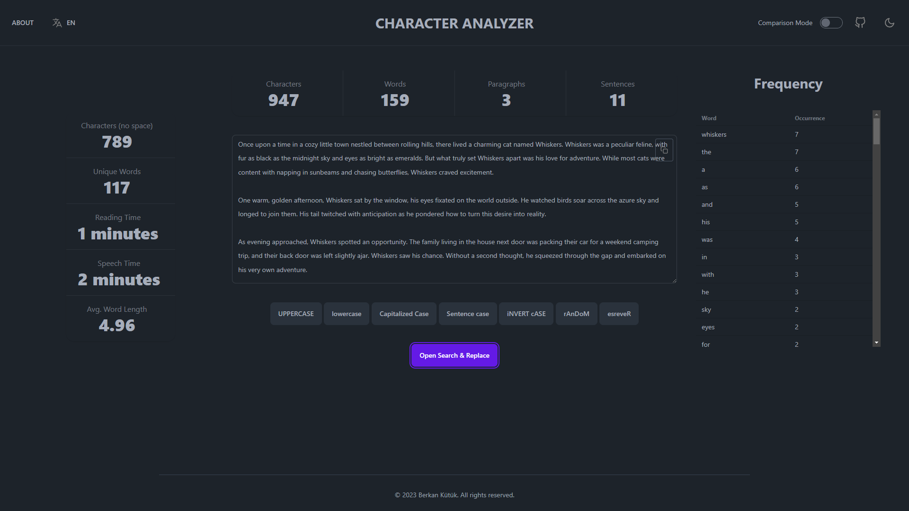
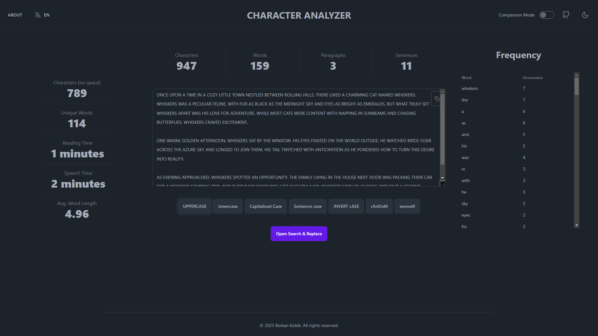
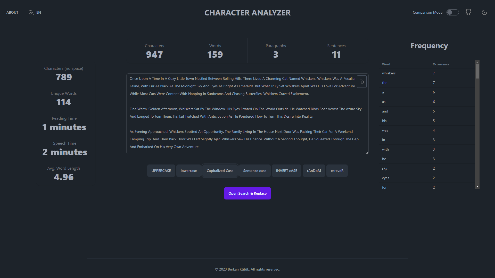
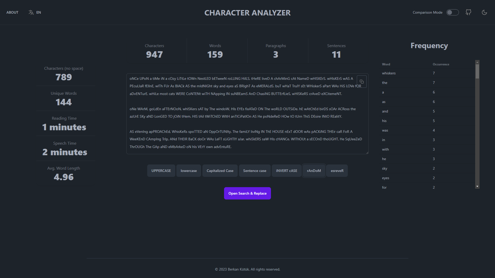

# Character Analyzer
A project made with SvelteKit, Tailwind and DaisyUI.



Find all images [here](/static/assets/).

## Features

**Character Analyzer** is a powerful and versatile text analysis tool designed to assist you in analyzing and manipulating text in various ways. Whether you're a writer, student, or simply interested in exploring the intricacies of written content, this feature-rich application has you covered.

### Word Analysis

Unlock a wide array of text analysis capabilities, including:

- **Counting Characters, Words, Paragraphs, and Sentences**: Get precise character and word counts, along with insights into paragraph and sentence structure.

- **Calculating Reading and Speech Time**: Estimate the time it takes to read or speak the text, providing valuable insights for content creators.

- **Determining the Average Word Length**: Understand the distribution of word lengths within your text.

- **Calculating the Total Amount of Unique Words**: Uncover the diversity of your vocabulary by identifying unique words.

### Text Transformation

Effortlessly transform your text to meet your specific needs:

- **Convert Text to Uppercase or Lowercase**: Change the letter case of your text with a single click.

<div style="display:flex; justify-content:center;">
  
</div>

- **Capitalize Text in Various Ways**: Apply capitalization rules to make your text conform to different styles.

<div style="display:flex; justify-content:center;">
  
</div>

- **Invert the Case of Characters**: Toggle between uppercase and lowercase characters to create unique effects.

- **Create Random Capitalization**: Add a touch of randomness to your text, creating a playful or eye-catching appearance.

<div style="display:flex; justify-content:center;">
  
</div>

- **Reverse the Text Order**: Flip the text to reveal hidden meanings or just to add a twist.

### Word Frequency

Gain insights into the frequency and usage of words within your text. Understand which words are used most often and their impact on your content.

### Search and Replace

Efficiently search for specific terms or phrases within your text and replace them with ease using the built-in search and replace tool. Perfect for making quick corrections or text modifications.


### Accessibility

Character Analyzer is committed to inclusivity and provides a user-friendly experience with comprehensive accessibility features, including:

- **Keyboard Navigation**: Navigate the application using your keyboard, ensuring that all users can easily access its features.

- **Screen Readers**: Compatibility with screen reader software, making the application accessible to users with visual impairments.

- **Light Mode and Dark Mode**: Choose between light and dark modes to suit your visual preferences and reduce eye strain during extended use.

<div style="display:flex; justify-content:center;">
  
  
</div>

- **Internationalization**: Support for multiple languages, allowing users around the world to experience the application in their preferred language.

# Future Plans
* [ ] Text Comparison
* [ ] Text Summarization

# Installation
1. Clone the repository
2. Install dependencies
```bash
npm install
```
3. Run the development server
```bash
npm run dev -- --open
```
4. Navigate to [localhost:5173](http://localhost:5173/)